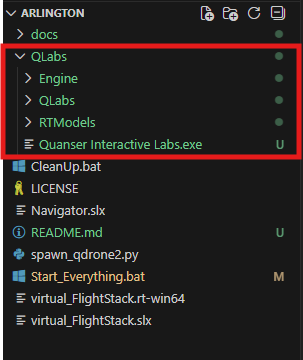
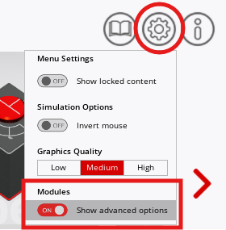
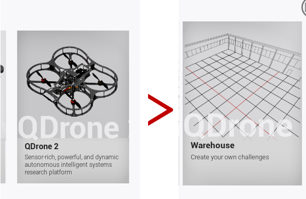
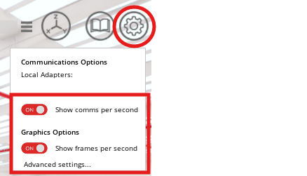
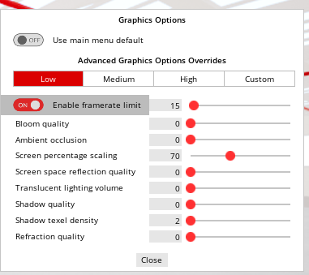

## Getting Started

### If you are going to use Python and not MATLAB/Simulink

These instructions are not relevant if you are planning on using Simulink.

Download Quanser Interactive Labs from https://qlabs.quanserdocs.com/en/latest/Get%20Started.html .

Run the exe file you just downloaded to install Quanser Interactive Labs. 

## Downloading Quanser's Resources

Start by downloading the resources and setting up your computer using the [Quanser Academic Resources](https://github.com/quanser/Quanser_Academic_Resources) repository.
Make sure to follow the instructions in the `Setting Up Your Computer` Section in that repository. ***Please skip any instructions on downloading Quanser Interactive Labs***.

> [!NOTE]
> **DO NOT FOLLOW ANY OF THE INSTRUCTIONS OF DOWNLOADING QUANSER INTERACTIVE LABS, FOLLOW THE INSTRUCTIONS IN THIS README INSTEAD**  
> Later in this guide there will be instructions on downloading Quanser Interactive Labs.

You should now have a `C:/Users/user/Documents/Quanser` folder with all of our resources.

## Downloading Arlington Specific Resources

The first step is to download these resources into your computer. We recommend downloading the files simply as a .zip file. 

### How to Download the Resources

1. Inside your `C:/Users/user/Documents/Quanser` folder that was created when downloading the Academic Resources, create a new folder with whatever name you prefer. We suggest calling it something like `Arlington_Competition`. This should live in the same level as the numbered folders (0_libraries, 1_setup ...).

2. Click the green Code button at the top of this GitHub page, click _Download ZIP_ at the bottom of the menu that pops up.

3. Unzip/extract the folder in your system.

4. Go into _Quanser_UT_Arlington_Comp-main_, you will see the individual files. Copy all the contents of that folder into your newly created `C:/Users/user/Documents/Quanser/Arlington_Competition` folder.

<a id="qlabs"></a>

### How to Download Quanser Interactive Labs

#### If you are using MATLAB/Simulink:

Note that this download is necessary but done only to get the Quanser blocks for Simulink. Do not try to open this version. Download the latest Quanser Interactive Labs from the Python section below and follow those instructions too. 

- Download Quanser Interactive Labs through the MATLAB Add On Explorer.

    

    ```
    Quanser Interactive Labs for MATLAB
    ```

    

    
#### If you are using Python:

Even after following the instructions at the top of the page for Python users, you still need to follow the instructions below.

1.  Download the latest Quanser Interactive Labs [from here](https://quanserinc.box.com/shared/static/1jqs60lq2hpebu55c7btbqo5wgrf8zgm.zip).

2.  Unzip the folder and move the complete folder (QLabs) inside the folder you created `C:/Users/user/Documents/Quanser/Arlington_Competition`.
    - The folder structure for the downloaded files should look like this: 

        

3. Open your new `QLabs` folder. Double click on `Quanser Interactive Labs.exe`, on the window that opens, fill your login information, click `remember me` and log in.

4. Close `Quanser Interactive Labs`. This steps ensure that when you run the provided bat files, you do not have to worry about logins anymore.


## Using the Files

1. Make sure you do not have Quanser Interactive Labs open.

2. Open the correct navigator file:
    - If you are going to be using Simulink, open `Arlington_Competition/Navigator.slx`.
    - If you are going to be using Python, open `navigator.py` in your preferred development environment. We use Visual Studio Code.

3. From your `Arlington_Competition` folder, run `Start_Everything_language.bat`.
    - NOTE: The `_matlab` version only exist for students who do not have python on their system. It does the same as the `_python` version but spawns things in the workspace using a matlab file, it is significantly slower since matlab through the command line is a bit slow. Use the `_python` if you have python installed on your computer.
    - This will open Quanser Interactive Labs and load the QDrone Workspace.
    - It will create colored structures around the workspace.
    - It will initialize the Drone models that will receive commands to fly the drone. 
    - The drone will take flight and hover around the [0,0,1] location in the world.

4. Using Simulink or Python, click run on your opened Navigator file. The existing examples will move the QDrone slowly in X,Y,Z as defined by the existing sine waves. If your drone goes unstable, please refer to the next section. 
    - Both files run at 200Hz and display cameras at 30Hz.
    - Both files take drone commands. In Simulink they are the `Drone Cmds` in the `DroneStack Comms` block. In Python, there is `cmd_x,cmd_y,cmd_z,cmd_yaw`.
    - Both files will display the following cameras: left, right, back, downward, RealSense RGB and RealSense Depth.
    - If you are using Python, the file includes comments as well as a section where you can modify or add code to help prevent breaking existing files. 
        - the variable simulationTime shows how long the code will run for. You can also stop it using Ctrl+C.

5. To stop everything:
    - Stop your Simulink or Python file. 
    - From your `Arlington_Competition` folder, run CleanUp.bat.  
    - Close Quanser Interactive Labs.

## If your QDrone is unstable

If your QDrone2 is unstable when running our provided navigator files, it probably is because Quanser Interactive Labs (qlabs) is pushing your graphics card too much. Follow these instructions to fix that.

1. In `QLabs` folder. Double click on `Quanser Interactive Labs.exe`, this will log you in and show you the first page of the application. 

2. Click on `Settings` on the top right and turn on `Show advanced options`

    

3. Click on QDrone and select the Warehouse Workspace.

    

4. With the Warehouse Workspace now opened, click on settings. Activate show comms per second and show frames per second. Click on Advanced Settings.

    

5. Under advanced settings, disable `Use main menu default` at the top. In Advanced Graphics Options 
    - Select LOW
    - Turn replace the 15 in the framerate limit from 15 to 30. The Advanced Graphics Options should now show Custom. 
    - Make sure Enable framerate limit is still turned on.  

        

6. Exit the workspace and close Quanser Interactive Labs. 

7. Go back to the previous section and try to run your files again.
